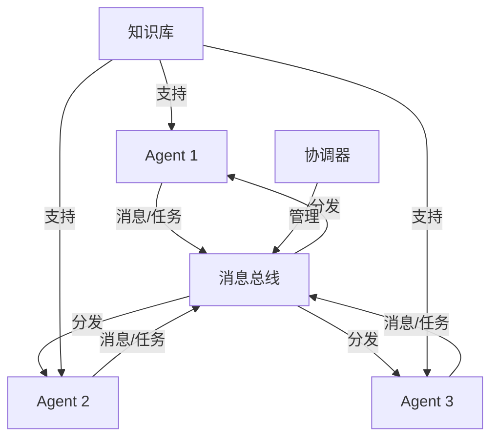
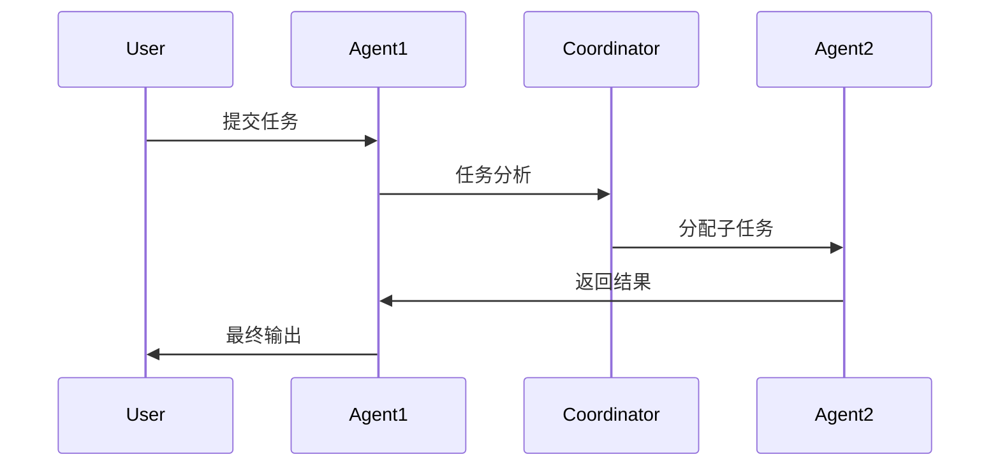
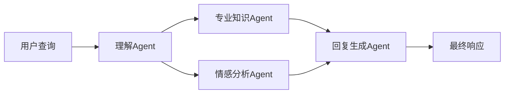

在人工智能快速发展的今天，Agent to Agent（智能体协作）技术正在成为一个令人兴奋的研究领域。本文将深入探讨智能体协作的原理、实践方法以及优缺点，帮助读者全面了解这项革命性技术。

<!--more-->

## 什么是Agent to Agent

Agent to Agent是指多个AI智能体之间进行自主交互和协作的技术范式。每个智能体都是一个独立的AI系统，具有特定的能力和职责，它们通过定义好的协议和接口相互通信，共同完成复杂的任务。

### 核心概念

1. 智能体(Agent)
   - 自主性：能够独立做出决策
   - 反应性：能够感知和响应环境变化
   - 主动性：能够采取主动行动实现目标
   - 社交性：能够与其他智能体交互

2. 协作协议
   - 通信格式
   - 消息路由
   - 任务分配
   - 冲突解决

## 系统架构



### 关键组件

1. 消息总线
   - 负责智能体间的消息路由
   - 确保消息的可靠传递
   - 支持异步通信

2. 协调器
   - 任务分配和调度
   - 资源管理
   - 冲突解决
   - 性能监控

3. 知识库
   - 共享知识存储
   - 经验累积
   - 规则库维护

## 工作流程



### 任务处理流程

1. 任务接收和分析
2. 任务分解和规划
3. 子任务分配
4. 并行执行
5. 结果聚合
6. 质量验证
7. 输出交付

## 实践应用

### 1. 智能客服系统



### 2. 自动化研究助手

- 文献搜索Agent
- 数据分析Agent
- 报告撰写Agent
- 审核校对Agent

### 3. 智能流程自动化

- 任务协调Agent
- 执行Agent
- 监控Agent
- 优化Agent

## 优势与挑战

### 优势

1. 高效协作
   - 并行处理
   - 专业分工
   - 资源优化

2. 可扩展性
   - 模块化设计
   - 灵活配置
   - 易于扩展

3. 鲁棒性
   - 故障隔离
   - 自动恢复
   - 负载均衡

### 挑战

1. 技术挑战
   - 通信开销
   - 一致性维护
   - 安全性保障

2. 协调问题
   - 任务分配
   - 冲突处理
   - 资源竞争

3. 可控性
   - 行为边界
   - 错误传播
   - 责任归属

## 最佳实践

### 1. 系统设计

- 明确定义每个Agent的职责
- 设计robust的通信协议
- 实现可靠的错误处理
- 建立完善的监控机制

### 2. 开发建议

```python
# Agent基类示例
class BaseAgent:
    def __init__(self, agent_id, capabilities):
        self.agent_id = agent_id
        self.capabilities = capabilities
        
    async def process_message(self, message):
        # 消息处理逻辑
        pass
        
    async def send_message(self, target_agent, content):
        # 消息发送逻辑
        pass
        
    def handle_error(self, error):
        # 错误处理逻辑
        pass
```

### 3. 部署注意事项

- 资源评估和规划
- 性能监控和优化
- 安全措施部署
- 备份和恢复策略

## 未来展望

1. 技术趋势
   - 更智能的协作机制
   - 更自然的交互方式
   - 更强的学习能力

2. 应用领域
   - 智能制造
   - 科学研究
   - 金融分析
   - 医疗诊断

3. 发展方向
   - 自适应协作
   - 知识共享
   - 群体智能

## 总结

Agent to Agent技术代表了AI系统协作的未来发展方向。通过合理的架构设计和实践应用，我们可以充分发挥多个智能体协作的优势，同时也需要注意应对相关挑战。随着技术的不断进步，我们相信Agent to Agent将在更多领域发挥重要作用。

<!--qr_code-->

## 捐赠

感谢老板请我喝杯咖啡！Thank you for buying me a coffee!

| WeChat | AliPay | PayPal |
| --- | --- | --- |
|  |  | [PayPal](https://paypal.me/JianboQin?country.x=C2&locale.x=zh_XC) |

### 公众号: 无限递归


<!--declare-declare-->

Copyright &copy; 2017 - 2025 boboidea.com All Rights Reserved 波波创意软件工作室 版权所有 【转载请注明出处】 